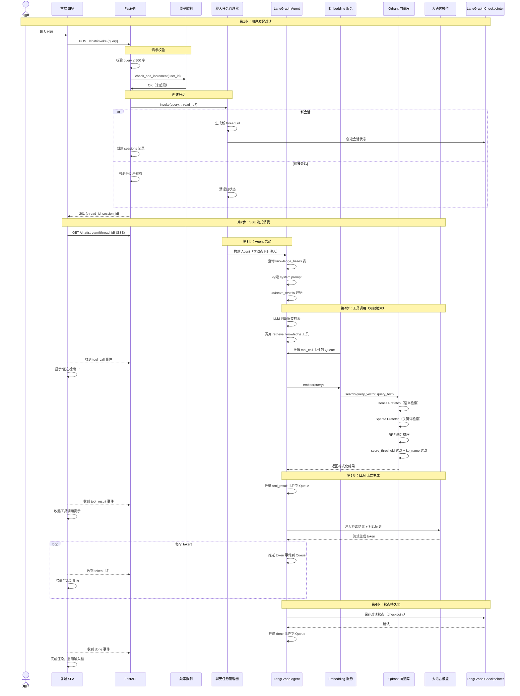
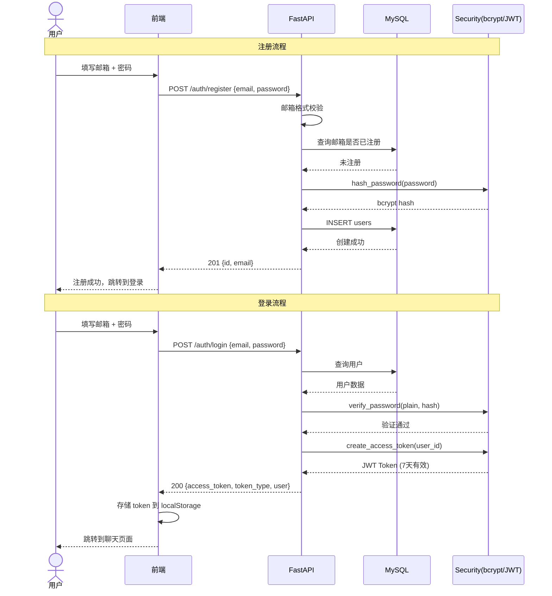
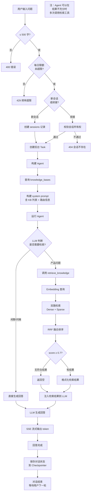
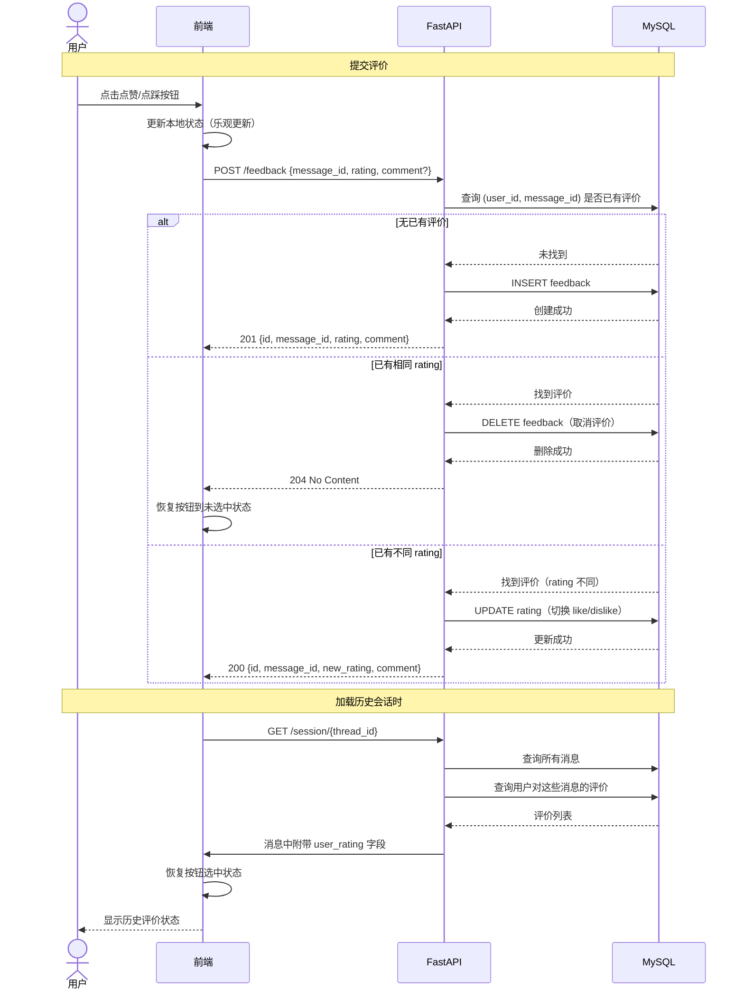

# 业务流程说明

> AI 智能客服系统 — 问答完整链路与业务流程

---

## 目录

- [完整问答链路图](#完整问答链路图)
- [注册与登录流程](#注册与登录流程)
- [知识库管理流程](#知识库管理流程)
- [问答对话流程](#问答对话流程)
- [反馈评价流程](#反馈评价流程)
- [会话管理流程](#会话管理流程)

---

## 完整问答链路图



---

## 注册与登录流程



---

## 知识库管理流程

```mermaid
flowchart TD
    %% 创建知识库
    U1[用户] -->|创建知识库| CreateKB[POST /knowledge/bases]
    CreateKB -->|校验名称唯一| CheckName{名称已存在?}
    CheckName -->|是| Error409[409 冲突]
    CheckName -->|否| InsertKB[INSERT knowledge_bases]
    InsertKB -->|创建磁盘目录| MkDir[mkdir knowledges/<name>/]
    MkDir --> ReturnKB[返回知识库信息]

    %% 上传文档
    U2[用户] -->|上传文档| Upload[POST /knowledge/upload]
    Upload -->|校验类型| CheckExt{扩展名<br>.md / .txt?}
    CheckExt -->|否| Error400[400 不支持]
    CheckExt -->|是| CheckSize{文件大小<br>≤ 10MB?}
    CheckSize -->|否| ErrorSize[400 文件过大]
    CheckSize -->|是| SaveFile[保存文件到磁盘]
    SaveFile -->|创建记录| CreateDoc[INSERT knowledge_docs<br>status=processing]
    CreateDoc -->|后台任务| Background[BackgroundTasks]
    Background --> Parse[parse_document 解析]
    Parse --> Split[text_splitter 分块]
    Split --> Embed[embed_batch 嵌入]
    Embed --> Upsert[Qdrant upsert]
    Upsert --> UpdateStatus[UPDATE status=ready]

    UpdateStatus -->|前端轮询| Poll[前端轮询 /knowledge/list]

    %% 删除文档
    U3[用户] -->|删除文档| Delete[DELETE /knowledge/{doc_id}]
    Delete --> DeleteVector[Qdrant 删除向量]
    DeleteVector --> DeleteFile[删除磁盘文件]
    DeleteFile --> DeleteDB[DELETE knowledge_docs]
```

---

## 问答对话流程



---

## 反馈评价流程



---

## 会话管理流程

```mermaid
flowchart LR
    %% 会话列表
    U1[用户] -->|查看会话列表| List[GET /session/list]
    List -->|按 user_id 查询| QuerySession[SELECT sessions<br>WHERE user_id=?<br>ORDER BY updated_at DESC]
    QuerySession -->|返回列表| ReturnList[会话列表<br>含 thread_id, title, 时间]

    %% 加载历史会话
    U2[用户] -->|点击历史会话| Load[GET /session/{thread_id}]
    Load -->|校验会话所有权| CheckOwner{属于当前用户?}
    CheckOwner -->|否| ReturnErr[404]
    CheckOwner -->|是| GetState[aget_state(thread_id)]
    GetState -->|从 Checkpointer 恢复| ParseMsgs[解析消息列表]
    ParseMsgs -->|提取消息 ID| QueryFb[查询用户评价]
    QueryFb -->|合并评价数据| ReturnDetail[返回完整对话记录<br>含消息列表 + 评价状态]

    %% 删除会话
    U3[用户] -->|删除会话| Delete[DELETE /session/{thread_id}]
    Delete --> StopTask[停止运行中的 Agent 任务]
    StopTask --> DeleteCP[删除 Checkpointer 数据]
    DeleteCP --> DeleteDB[DELETE sessions 记录]
    DeleteDB --> Return204[204 No Content]

    %% 自动删除反馈数据说明
    Note[说明：feedbacks 表<br>通过 message_id 关联，<br>不随会话删除级联<br>以保持反馈数据完整性]
