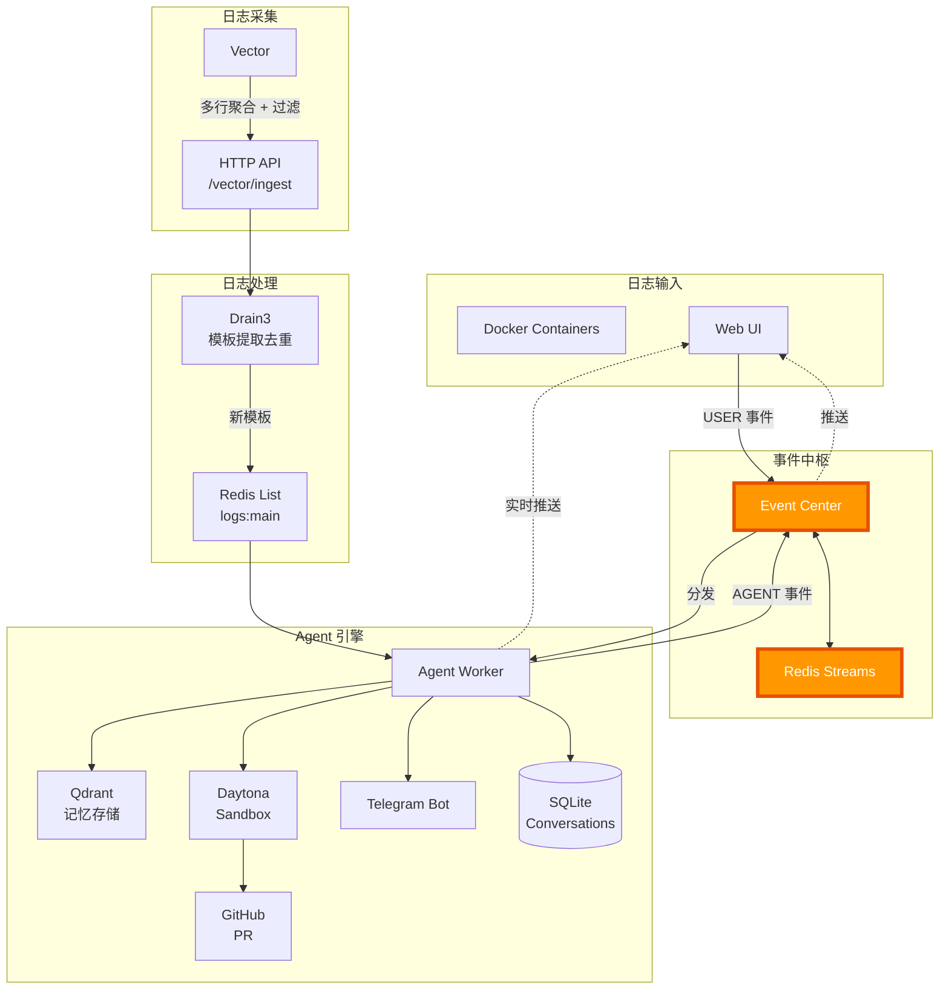
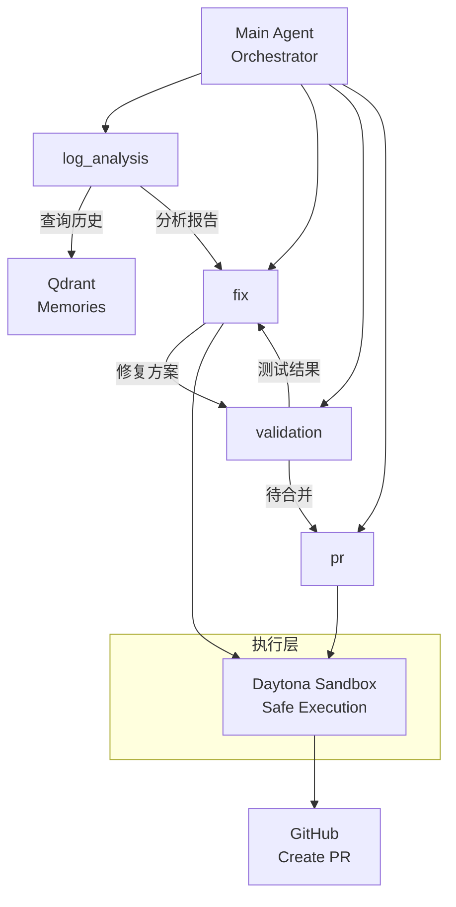
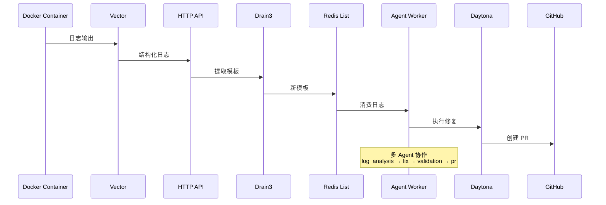

# Auperator

> **Automation Operator** - 智能运维 Agent

Auperator 是一个基于 DeepAgents 架构的智能运维系统，能够自动监控 Web 应用、收集日志、智能分析并修复问题，最终通过提交 PR 完成闭环修复。

## 概述

Auperator 致力于解决传统运维系统中的痛点：被动响应、依赖人工分析、修复周期长。通过引入 AI Agent 技术，实现从问题发现到修复的全自动化闭环。

**双界面模式**：

- **CLI 模式**：命令行界面，用于日志消费和自动修复
- **Web UI 模式**：基于 Next.js 的聊天界面，支持实时对话和事件流

## 核心功能

### 1. 日志采集（集成 Vector.dev）

使用专业的日志处理工具 **Vector.dev** 进行日志采集和处理。

#### 特性

- **多行日志聚合**：自动合并多行错误日志（如 Python Traceback、Java Stack Trace）
- **智能过滤**：基于关键词和模式的错误日志过滤
- **实时处理**：流式处理，低延迟
- **结构化输出**：统一的 JSON 格式输出

### 2. 智能去重（集成 Drain3）

使用 **Drain3** 算法进行日志模板提取和去重：

- **在线学习**：持续学习新的日志模板
- **模板提取**：自动识别日志中的变量部分
- **智能去重**：相同模板的日志只处理一次
- **状态持久化**：学习的模板持久化保存，重启不丢失

### 3. 自动修复（AI Agent）

基于 DeepAgents 架构的核心智能体，负责问题分析、决策和执行。

#### 核心能力

| 能力        | 描述                          |
| --------- | --------------------------- |
| **问题分析**  | 基于日志模板，分析错误根因               |
| **代码沙箱**  | 内置隔离的代码运行环境，安全执行修复代码        |
| **自动修复**  | 在沙箱中定位问题、实施修复、运行测试          |
| **PR 提交** | 自动创建分支、提交代码、发起 Pull Request |
| **记忆系统**  | 基于 Qdrant 的向量存储，支持长期记忆      |
| **多轮对话**  | 支持上下文保持的对话交互                |

### 4. Web UI（新增）

基于 Next.js 的现代化 Web 界面：

- **实时聊天**：与 Agent 进行自然语言交互
- **对话管理**：创建、重命名、删除对话
- **事件流**：基于 SSE 的实时事件推送
- **源过滤**：按来源筛选对话（终端、Web UI）

### 5. 事件系统（新增）

基于 Redis Streams 的事件驱动架构：

- **实时事件**：USER、AGENT、ERROR、STATUS 事件类型
- **消费者组**：支持多消费者并行处理
- **SSE 推送**：服务端事件流实时推送
- **异步处理**：Agent Worker 后台任务处理

### 6. Telegram 通知（新增）

集成 Telegram Bot，实时推送 Agent 处理结果：

- **WebHook 模式**：自动接收 Telegram 更新
- **消息推送**：Agent 事件实时推送到指定聊天
- **简单配置**：仅需 Bot Token 即可启用

## 架构

### 系统架构图



### Agent 内部架构（Multi-Agent）



### 数据流



### CLI 模式数据流

1. **Vector** 采集 Docker 容器日志
2. **Vector** 过滤错误日志（error、exception、traceback、5xx）
3. **Vector** 发送到 Auperator API `/vector/ingest`
4. **API** 使用 Drain3 提取日志模板并去重
5. **API** 只推送新模板到 Redis List
6. **Agent Handler** 消费日志并调用 Agent 修复

### Web UI 模式数据流

1. **用户** 通过 Web UI 发送消息
2. **前端** 调用 `POST /chat/messages`
3. **后端** 在 SQLite 中创建对话记录
4. **后端** 发布 USER 事件到 Redis Stream
5. **AgentWorker** 消费事件并调用 Agent
6. **Agent** 发布 AGENT 事件到 Redis Stream
7. **前端** 通过 SSE 端点 `/events/web-ui` 接收事件
8. **前端** 实时显示 Agent 响应

## 快速开始

### 系统要求

- Python 3.11+
- Node.js 18+ (用于 Web UI)
- Vector 0.40+
- Redis 7+
- Docker（用于日志采集）
- Qdrant（可选，用于记忆系统）

### 安装

```bash
# 克隆仓库
git clone https://github.com/thcpdd/auperator.git
cd auperator

# 安装后端依赖
uv pip install -e .

# 安装前端依赖
cd src/web
npm install
# 或使用 pnpm（推荐）
pnpm install
```

### 配置

编辑 `.env` 文件：

```bash
# API 配置
API_HOST=127.0.0.1
API_PORT=7000

# Redis 配置
REDIS_HOST=localhost
REDIS_PORT=6379
REDIS_PASSWORD=
REDIS_DB=0
REDIS_KEY_PREFIX=auperator:
REDIS_LIST_NAME=logs:main

# 事件流配置
REDIS_EVENT_STREAM=events:all

# Drain3 配置
DRAIN3_STATE_FILE=drain3.json
DRAIN3_DEPTH=4
DRAIN3_MAX_CLUSTERS=1000
DRAIN3_MAX_CHILDREN=100
DRAIN3_SIM_TH=0.4

# OpenAI 配置
OPENAI_API_KEY=your-api-key
OPENAI_BASE_URL=https://api.openai.com/v1
OPENAI_MODEL=gpt-4

# LangFuse 配置（可选）
LANGFUSE_PUBLIC_KEY=
LANGFUSE_SECRET_KEY=
LANGFUSE_HOST=

# Daytona 配置
DAYTONA_API_KEY=
DAYTONA_API_URL=https://app.daytona.io/api

# Git 配置
REMOTE_REPO_URL=git@github.com:username/repo.git
GITHUB_TOKEN=your-github-token

# 嵌入模型配置（用于记忆系统）
EMBEDDING_API_BASE_URL=https://api.openai.com/v1
EMBEDDING_API_KEY=your-api-key
EMBEDDING_MODEL=text-embedding-3-small
EMBEDDING_VECTOR_SIZE=1536

# Qdrant 配置
QDRANT_URL=http://localhost:6333
QDRANT_API_KEY=
QDRANT_COLLECTION=auperator_memories

# SQLite 配置
SQLITE_DB_FILE=auperator.db.sqlite3

# 消费者配置
CONSUMER_BATCH_SIZE=1
CONSUMER_BLOCK_TIMEOUT=5

# Telegram 配置
TELEGRAM_BOT_TOKEN=           # Telegram Bot Token
TELEGRAM_WEBHOOK_URL=         # WebHook 回调地址
TELEGRAM_WEBHOOK_SECRET=      # WebHook 密钥

# Vector 配置
VECTOR_IMAGE=                # Vector 镜像名称
```

### 启动服务

#### 完整启动（后端 + 前端 + Vector）

```bash
# 终端 1: 启动 Auperator API 服务
auperator server

# 终端 2: 启动 Vector（用于日志采集）
vector --config vector.yaml

# 终端 3: 启动 Web UI
cd src/web
npm run dev
# 或
pnpm dev

# 终端 4: 启动自动修复模式（可选）
auperator start
```

#### 仅启动 Web UI

```bash
# 终端 1: 启动 API 服务
auperator server

# 终端 2: 启动 Web UI
cd src/web && npm run dev
```

访问 <http://localhost:3000> 使用 Web UI

#### Docker 部署

使用 Docker Compose 一键启动所有服务：

```bash
cd deploy

# 启动所有服务（Redis + Qdrant + API + Web UI）
docker-compose up -d

# 包含 Vector 日志采集
docker-compose --profile vector up -d

# 查看服务状态
docker-compose ps

# 查看日志
docker-compose logs -f api
docker-compose logs -f web

# 停止服务
docker-compose down
```

**Docker Compose 服务**：

| 服务   | 端口  | 描述              |
| ------ | ----- | ----------------- |
| redis  | 6379  | Redis 7 Alpine    |
| qdrant | 6333  | Qdrant 向量数据库 |
| api    | 7000  | Auperator API     |
| web    | 3000  | Next.js Web UI    |
| vector | -     | 日志采集（可选）  |

**Nginx 反向代理**：deploy/nginx.conf 提供生产级 Nginx 配置。

详细部署说明请参考 [deploy/README.md](deploy/README.md)。

#### 仅启动 CLI 模式

```bash
# 终端 1: 启动 API 服务
auperator server

# 终端 2: 启动 Vector
vector --config vector.yaml

# 终端 3: 启动自动修复
auperator start
```

## CLI 命令

### 主命令

```bash
# 启动 API 服务
auperator server

# 启动自动修复模式
auperator start

# 终端消费模式（调试）
auperator terminal-consume -v

# 查看 Redis List 信息
auperator list-info

# 初始化项目记忆（分析目标项目并生成 AUPERATOR.md）
auperator init
```

### 命令选项

```bash
# server 命令选项
auperator server [OPTIONS]

选项：
  -h, --host TEXT     API server host (default: 127.0.0.1)
  -p, --port INT      API server port (default: 7000)
  --reload            Enable auto-reload on code changes

# start 命令选项
auperator start [OPTIONS]

选项：
  -r, --redis TEXT         Redis 连接 URL
  -e, --enable-langfuse    启用 Langfuse 追踪

# terminal-consume 命令选项
auperator terminal-consume [OPTIONS]

选项：
  -r, --redis TEXT     Redis 连接 URL
  -l, --list TEXT      List 名称
  -v, --verbose        详细输出模式

# list-info 命令选项
auperator list-info [OPTIONS]

选项：
  -r, --redis TEXT     Redis 连接 URL
  -l, --list TEXT      List 名称

# init 命令选项
auperator init [OPTIONS]

选项：
  --project-path TEXT   目标项目路径（默认：当前目录）
```

## Web UI 功能

### 主要功能

- **聊天界面**：与 Agent 进行自然语言交互
- **对话列表**：侧边栏显示所有对话历史
- **对话管理**：创建、重命名、删除对话
- **源过滤**：按来源筛选对话（终端、Web UI）
- **实时响应**：基于 SSE 的实时事件流
- **Markdown 渲染**：支持 Markdown 格式输出
- **代码高亮**：语法高亮显示

### API 端点

#### 聊天相关

```bash
# 创建对话
POST /chat/conversations

# 获取对话列表
GET /chat/conversations

# 获取对话详情
GET /chat/conversations/{conversation_id}

# 更新对话标题
PUT /chat/conversations/{conversation_id}

# 删除对话
DELETE /chat/conversations/{conversation_id}

# 发送消息
POST /chat/messages

# 获取对话消息
GET /chat/conversations/{conversation_id}/messages
```

#### 事件流

```bash
# Web UI 事件流（SSE）
POST /events/web-ui
Body: {"thread_id": "optional-conversation-id"}

# Docker 日志流（SSE）
POST /events/docker-logs
```

#### 内存管理

```bash
# 搜索记忆
GET /memory/search?q=query

# 添加记忆
POST /memory

# 获取记忆列表
GET /memory
```

## 项目结构

```
auperator/
├── README.md               # 项目文档
├── CLAUDE.md               # Claude Code 开发指南
├── pyproject.toml          # Python 项目配置
├── uv.lock                 # uv 锁文件
├── .python-version         # Python 版本
├── .env                    # 环境变量配置
├── .env.example            # 环境变量配置示例
├── vector.yaml             # Vector 日志采集配置
├── vector.example.yaml     # Vector 配置示例
├── drain3.json             # Drain3 状态文件（自动生成）
├── auperator.db.sqlite3    # SQLite 数据库（自动生成）
├── test.py                 # 测试文件
├── test1.py                # 测试文件
│
├── deploy/                 # Docker 部署配置
│   ├── Dockerfile.api      # API 服务 Dockerfile
│   ├── Dockerfile.web       # Web UI Dockerfile
│   ├── docker-compose.yml  # Docker 编排配置
│   ├── nginx.conf          # Nginx 反向代理配置
│   └── README.md           # 部署文档
│
├── docs/                   # 文档目录
│   ├── README.md
│   └── index.md
│
├── src/
│   └── auperator/
│       ├── cli.py               # 主命令行接口
│       ├── server.py            # FastAPI 应用入口
│       ├── config.py            # 配置管理
│       ├── state.py             # 全局状态管理
│       ├── dependencies.py      # 依赖注入
│       │
│       ├── collector/           # 日志采集和消费
│       │   ├── handlers/        # 日志处理器
│       │   │   ├── base.py      # 基础处理器接口
│       │   │   ├── agent.py     # Agent 处理器（调用 LangGraph）
│       │   │   ├── console.py   # 控制台处理器（调试）
│       │   │   └── event.py     # 事件处理器（发布到 EventCenter）
│       │   └── vector_consumer.py # Redis List 消费者
│       │
│       ├── deepagents/          # Agent 架构
│       │   ├── builder.py       # Agent 创建工厂
│       │   ├── worker.py        # Agent Worker（后台任务处理）
│       │   ├── backends/        # 后端实现
│       │   │   ├── protocol.py  # 后端协议定义
│       │   │   ├── local_shell.py # 本地 Shell 后端
│       │   │   ├── sandbox.py   # Daytona 沙箱后端
│       │   │   ├── daytona_sandbox.py # Daytona SDK 后端
│       │   │   ├── composite.py # 组合后端
│       │   │   ├── state.py     # 内存状态后端
│       │   │   ├── filesystem.py # 文件系统后端
│       │   │   ├── store.py     # 持久化存储后端
│       │   │   └── utils.py     # 后端工具函数
│       │   ├── middleware/      # Agent 中间件
│       │   │   ├── filesystem.py # 文件操作中间件
│       │   │   ├── memory.py     # 记忆中间件
│       │   │   ├── skills.py     # 技能加载中间件
│       │   │   ├── subagents.py  # 子 Agent 中间件
│       │   │   ├── summarization.py # 输出摘要中间件
│       │   │   ├── patch_tool_calls.py # 工具调用修补
│       │   │   ├── event.py      # 事件中间件
│       │   │   └── _utils.py     # 中间件工具函数
│       │   ├── tools/           # Agent 工具
│       │   │   ├── docker_tools.py  # Docker 操作
│       │   │   ├── pull_request.py  # GitHub PR 创建
│       │   │   ├── memory_tools.py # 记忆存储/检索
│       │   │   ├── state_tools.py  # 状态管理工具
│       │   │   ├── vector_tools.py # Vector/日志工具
│       │   │   └── registry.py      # 工具注册表
│       │   ├── skills/          # 技能文件
│       │   │   └── vector/      # Daytona 技能
│       │   └── prompts/         # 系统提示词
│       │       ├── system.py     # 主 Agent 系统提示词
│       │       ├── log_analysis.py
│       │       ├── fix.py
│       │       ├── validation.py
│       │       ├── pr.py
│       │       └── initialize.py # 项目初始化提示词
│       │
│       ├── schemas/             # 数据模型
│       │   ├── vector.py        # Vector 日志模型
│       │   ├── daytona.py       # Daytona 模型
│       │   ├── log.py           # 日志数据模型
│       │   ├── event.py         # 事件模型
│       │   ├── conversation.py  # 对话模型
│       │   ├── memory.py        # 记忆模型
│       │   └── docker_log.py    # Docker 日志模型
│       │
│       ├── services/            # 业务服务
│       │   ├── drain3_service.py # Drain3 服务
│       │   ├── daytona_service.py # Daytona 沙箱服务
│       │   ├── memory_service.py  # Qdrant 记忆服务
│       │   └── telegram_service.py # Telegram 机器人服务
│       │
│       ├── events/              # 事件系统
│       │   ├── event_center.py  # 事件发布和消费
│       │   └── __init__.py
│       │
│       ├── database/            # 数据库层
│       │   ├── db.py            # 数据库会话管理
│       │   ├── models.py        # SQLAlchemy 模型
│       │   └── base.py          # 基础数据库类
│       │
│       ├── routes/              # FastAPI 路由
│       │   ├── vector.py        # Vector 日志接收
│       │   ├── daytona.py       # 沙箱管理
│       │   ├── chat.py          # 聊天 API
│       │   ├── events.py        # SSE 事件流
│       │   └── memory.py        # 记忆管理
│       │
│       └── utils/               # 工具函数
│           ├── embeddings.py    # 嵌入模型
│           ├── logging.py       # 日志配置
│           └── checkpointer.py  # 状态持久化
│
└── src/web/                     # Next.js Web UI
    ├── app/                     # Next.js app 目录
    │   ├── page.tsx             # 首页
    │   ├── layout.tsx           # 根布局
    │   ├── globals.css          # 全局样式
    │   ├── chat/page.tsx        # 聊天页面
    │   ├── config/page.tsx      # 配置页面
    │   ├── logs/page.tsx        # 日志页面
    │   ├── status/page.tsx      # 状态页面
    │   └── api/events/          # SSE API 路由
    │       ├── docker-logs/route.ts  # Docker 日志流
    │       └── web-ui/route.ts   # Web UI 事件流
    ├── components/
    │   ├── layout/              # 布局组件
    │   │   ├── Header.tsx       # 头部
    │   │   ├── Sidebar.tsx      # 侧边栏（对话列表）
    │   │   └── MainLayout.tsx   # 主布局
    │   ├── ui/                  # UI 基础组件
    │   │   ├── markdown.tsx     # Markdown 渲染
    │   │   ├── scroll-area.tsx  # 滚动区域
    │   │   └── ...
    │   └── views/               # 视图组件
    │       ├── ChatView.tsx     # 聊天视图
    │       ├── ConfigView.tsx   # 配置视图
    │       └── StatusView.tsx  # 状态视图
    ├── hooks/                   # React Hooks
    │   ├── useChat.ts          # 聊天状态管理
    │   ├── useConversations.ts  # 对话管理
    │   └── useSSE.ts           # SSE 事件流
    ├── lib/                     # 工具库
    │   ├── api.ts              # API 客户端
    │   ├── types.ts            # TypeScript 类型
    │   └── utils.ts            # 工具函数
    ├── next.config.ts          # Next.js 配置
    ├── postcss.config.mjs      # PostCSS 配置
    ├── eslint.config.mjs       # ESLint 配置
    ├── components.json          # shadcn/ui 配置
    ├── package.json             # 前端依赖
    └── README.md               # Web UI 文档
```

## Vector 配置

> 配置文件：`vector.yaml`（实际配置）、`vector.example.yaml`（配置示例）

### vector.yaml

```yaml
sources:
  docker_logs:
    type: "docker_logs"
    include_containers: ["container_name"]  # 指定容器名称

transforms:
  # 多行日志聚合
  merged_logs:
    type: "reduce"
    inputs: ["docker_logs"]
    group_by: ["container_id"]
    merge_strategies:
      message: "concat"
    starts_when: |
      msg = to_string(.message) ?? ""
      match(msg, r'^(\d{4}|\[|\d{2}:\d{2}|INFO|DEBUG|WARN|ERROR|CRITICAL)')
    expire_after_ms: 1000

  # 错误过滤
  error_only_filter:
    type: "filter"
    inputs: ["merged_logs"]
    condition: |
      msg = downcase(to_string(.message) ?? "")
      contains(msg, "error") ||
      contains(msg, "exception") ||
      contains(msg, "traceback") ||
      contains(msg, "critical") ||
      contains(msg, "fatal") ||
      match(msg, r' (5\d{2}) ')

sinks:
  # HTTP sink - 发送到 Auperator API
  http_output:
    type: "http"
    inputs: ["error_only_filter"]
    uri: "http://172.17.0.1:7000/vector/ingest"  # Docker 网关 IP
    encoding:
      codec: "json"
    batch:
      max_events: 10
      timeout_secs: 5
    request:
      timeout_secs: 10
      retry_attempts: 3

  # 控制台输出（调试用）
  console_output:
    type: "console"
    inputs: ["error_only_filter"]
    encoding:
      codec: "json"
```

**注意**：

- 如果 Vector 在 Docker 中运行，使用 `172.17.0.1` 访问宿主机服务
- 如果 Vector 在宿主机运行，使用 `127.0.0.1`

## 调试和监控

### 查看 Redis 数据

```bash
# 查看 Redis List 中的日志数量
redis-cli LLEN auperator:logs:main

# 查看 Redis Stream 事件
redis-cli XRANGE auperator:events:all - +

# 查看消费者组
redis-cli XINFO GROUPS auperator:events:all

# 查看消费者
redis-cli XINFO CONSUMERS auperator:events:all agent-worker

# 查看对话历史
sqlite3 auperator.db.sqlite3 "SELECT id, thread_id, title, created_at FROM conversations;"

# 查看 Agent checkpoints
sqlite3 auperator.db.sqlite3 "SELECT * FROM checkpoints;"
```

### Docker 调试

```bash
# 查看所有容器状态
docker ps

# 查看 API 服务日志
docker logs -f auperator-api

# 查看 Web UI 日志
docker logs -f auperator-web

# 进入 API 容器
docker exec -it auperator-api /bin/bash

# 查看 Vector 日志
docker logs -f auperator-vector

# 重启指定服务
docker-compose restart api
docker-compose restart web
```

### 启用 Langfuse 追踪

```bash
auperator start --enable-langfuse
```

### 查看日志

```bash
# 终端消费模式（调试）
auperator terminal-consume -v

# 启用详细日志
LOG_LEVEL=DEBUG auperator server
```

## 工作流程示例

### CLI 模式 - 自动修复流程

#### 1. 错误日志产生

```
ERROR: Connection refused to 10.0.0.1:5432
```

#### 2. Vector 采集并发送

```json
{
  "message": "ERROR: Connection refused to 10.0.0.1:5432",
  "timestamp": "2026-04-04T14:30:00Z",
  "container_name": "backend-1",
  "host": "server-01"
}
```

#### 3. Drain3 提取模板

```json
{
  "template_mined": "ERROR: Connection refused to <*:<:NUM:>>",
  "cluster_id": 1,
  "is_new_template": true
}
```

#### 4. 推送到 Redis

```json
{
  "message": "ERROR: Connection refused to <*:<:NUM:>>",
  "cluster_id": 1,
  "timestamp": "2026-04-04T14:30:00Z"
}
```

#### 5. Agent 处理

- 分析错误原因（数据库连接失败）
- 在 Daytona 沙箱中克隆代码
- 定位问题代码（缺少数据库配置）
- 实施修复（添加配置文件）
- 运行测试验证
- 提交 PR

### Web UI 模式 - 对话流程

#### 1. 用户发送消息

```json
POST /chat/messages
{
  "conversation_id": "optional-uuid",
  "message": "分析最近的错误日志"
}
```

#### 2. 后端处理

- 创建/获取对话记录
- 发布 USER 事件到 Redis Stream
- AgentWorker 消费事件
- 调用 Agent 处理

#### 3. Agent 响应

- 分析问题
- 执行操作
- 发布 AGENT 事件
- 前端通过 SSE 接收
- 实时显示响应

## 故障排查

### Vector 无法连接 API

如果看到 `Connection refused` 错误：

1. 确认 API 服务已启动：`curl http://127.0.0.1:7000/health`
2. 如果 Vector 在 Docker 中，使用 `172.17.0.1` 代替 `127.0.0.1`
3. 检查防火墙设置

### Web UI 无法连接后端

1. 确认 API 服务运行在正确端口
2. 检查 CORS 配置
3. 查看浏览器控制台错误

### Drain3 状态丢失

- Drain3 状态保存在 `drain3.json` 中
- 重启 API 服务会自动加载之前学习的模板
- 确保 `drain3.json` 文件可写

### Agent 处理失败

1. 检查 OpenAI API 配置
2. 查看 Langfuse 追踪日志（如果启用）
3. 启用详细日志：`LOG_LEVEL=DEBUG`
4. 检查 Redis Stream 事件

### SSE 事件流中断

1. 检查 Redis 连接
2. 确认消费者组状态
3. 查看浏览器网络连接状态

## 贡献指南

1. Fork 本仓库
2. 创建你的特性分支 (`git checkout -b feature/AmazingFeature`)
3. 提交你的修改 (`git commit -m 'Add some AmazingFeature'`)
4. 推送到分支 (`git push origin feature/AmazingFeature`)
5. 开启一个 Pull Request

## 文档

- [CLAUDE.md](CLAUDE.md) - Claude Code 开发指南
- [.env.example](.env.example) - 环境变量配置示例
- [deploy/README.md](deploy/README.md) - Docker 部署指南
- [docs/](docs/) - 项目文档目录
- [src/web/README.md](src/web/README.md) - Web UI 开发文档

## 联系方式

- 项目主页：<https://github.com/thcpdd/auperator>
- 问题反馈：<https://github.com/thcpdd/auperator/issues>
- 邮件联系：<1834763300@qq.com>

***

<p align="center">Made with ❤️ by Auperator Team</p>
