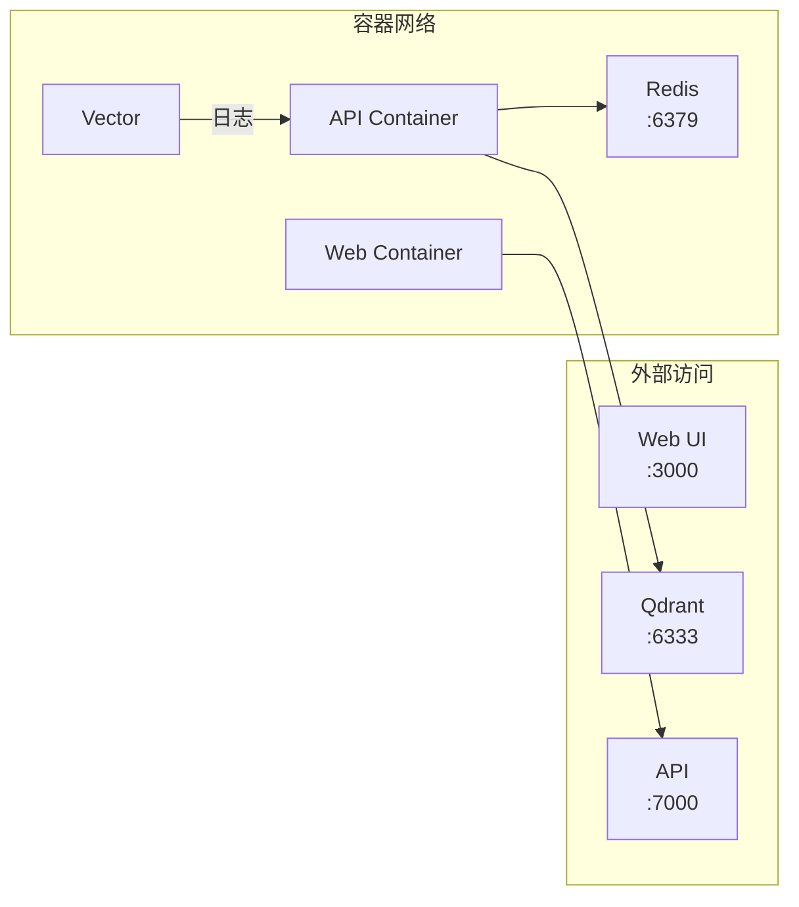
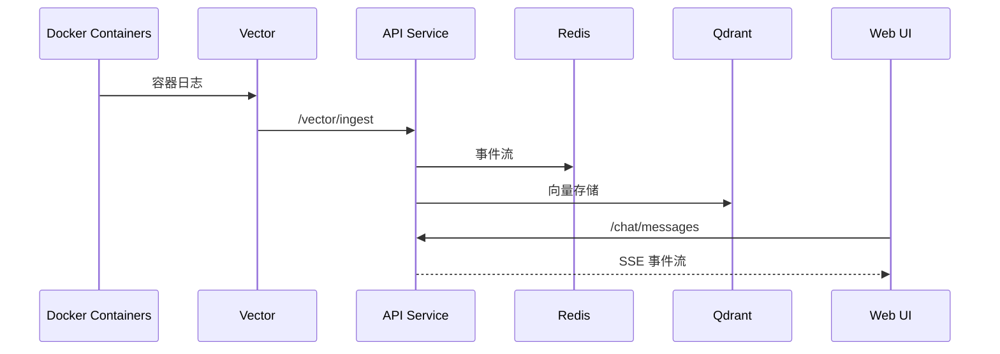

# Auperator 部署文档

## 目录

- [快速开始](#快速开始)
- [项目结构](#项目结构)
- [环境要求](#环境要求)
- [部署步骤](#部署步骤)
- [服务架构](#服务架构)
- [配置详解](#配置详解)
- [服务管理](#服务管理)
- [Nginx 配置](#nginx-配置)
- [数据持久化](#数据持久化)
- [故障排查](#故障排查)
- [性能优化](#性能优化)
- [安全配置](#安全配置)
- [备份恢复](#备份恢复)
- [版本更新](#版本更新)

---

## 快速开始

```bash
# 1. 克隆仓库
git clone https://github.com/thcpdd/auperator.git
cd auperator

# 2. 配置环境变量
cp .env.example .env
vim .env  # 填写必要的 API 密钥

# 3. 启动服务
cd deploy
docker compose up -d --build

# 4. 访问
open http://localhost:3000
```

---

## 项目结构

```
deploy/
├── docker-compose.yml    # Docker Compose 编排配置
├── docker-compose.prod.yml  # 生产环境配置（可选）
├── Dockerfile.api        # API 服务多阶段构建
├── Dockerfile.web       # Web UI 多阶段构建
├── nginx.conf           # Nginx 反向代理配置
└── README.md            # 本文档

根目录
├── .env                 # 环境变量配置
├── .env.example         # 环境变量模板
├── vector.yaml          # Vector 日志采集配置
├── pyproject.toml       # Python 项目配置
├── src/
│   └── auperator/       # 后端源码
│   └── web/             # 前端源码
└── docs/                # 文档目录
```

---

## 环境要求

| 要求 | 最低 | 推荐 |
|------|------|------|
| Docker | 20.10+ | 24.0+ |
| Docker Compose | 1.29+ | 2.20+ |
| CPU | 2 核 | 4 核+ |
| 内存 | 4 GB | 8 GB+ |
| 磁盘 | 20 GB | 50 GB+ SSD |

### 必要配置

| 配置项 | 说明 |
|--------|------|
| `OPENAI_API_KEY` | OpenAI API 密钥（必须） |
| `QDRANT_URL` | Qdrant 服务地址（默认 http://qdrant:6333，容器内使用） |

---

## 部署步骤

### 1. 克隆并进入目录

```bash
git clone https://github.com/thcpdd/auperator.git
cd auperator/deploy
```

### 2. 配置环境变量

```bash
cp ../.env.example ../.env
```

编辑 `../.env`，设置以下必须项：

```env
# OpenAI 配置（必须）
OPENAI_API_KEY=sk-your-key
OPENAI_BASE_URL=https://api.openai.com/v1
OPENAI_MODEL=gpt-4

# Redis（容器内使用默认值即可）
REDIS_HOST=redis
REDIS_PORT=6379

# Qdrant（容器内使用默认值即可）
QDRANT_URL=http://qdrant:6333
```

### 3. 构建并启动

```bash
# 启动核心服务（Redis + Qdrant + API + Web UI）
docker compose up -d --build

# 启动包含 Vector 日志采集
docker compose --profile vector up -d
```

### 4. 验证服务

```bash
# 查看服务状态
docker compose ps

# 健康检查
curl http://localhost:7000/health
```

预期输出：

```json
{"status":"healthy","redis":"connected","version":"1.0.0"}
```

---

## 服务架构

### 服务列表



### Docker Compose 服务

| 服务 | 镜像 | 端口 | 说明 |
|------|------|------|------|
| `redis` | redis:7-alpine | 6379 | 消息队列 + 事件流 |
| `qdrant` | qdrant/qdrant:v1.17.0 | 6333 | 向量数据库 |
| `api` | 本地构建 | 7000 | FastAPI 后端服务 |
| `web` | 本地构建 | 3000 | Next.js 前端 |
| `vector` | timberio/vector:0.53.0-debian | - | 日志采集（可选） |

### 数据流



---

## 配置详解

### docker-compose.yml

```yaml
services:
  api:
    build: ..
    ports:
      - "7000:7000"
    environment:
      - REDIS_HOST=redis
      - REDIS_PORT=6379
    volumes:
      - ../:/app
      - /tmp:/tmp  # Daytona 沙箱临时目录
    depends_on:
      redis:
        condition: service_healthy
      qdrant:
        condition: service_healthy

  web:
    build: ..
    ports:
      - "3000:3000"

  redis:
    image: redis:7-alpine
    ports:
      - "6379:6379"
    volumes:
      - redis_data:/data
    healthcheck:
      test: ["CMD", "redis-cli", "ping"]
      interval: 5s
      timeout: 3s

  qdrant:
    image: qdrant/qdrant:v1.17.0
    ports:
      - "6333:6333"
    volumes:
      - qdrant_data:/qdrant/storage

volumes:
  redis_data:
  qdrant_data:
```

### 环境变量

#### API 服务

| 变量 | 默认值 | 说明 |
|------|--------|------|
| `API_HOST` | 0.0.0.0 | 监听地址 |
| `API_PORT` | 7000 | 监听端口 |
| `API_RELOAD` | false | 代码热重载 |
| `API_WORKERS` | 1 | 工作进程数 |

#### Redis

| 变量 | 默认值 | 说明 |
|------|--------|------|
| `REDIS_HOST` | redis | Redis 主机 |
| `REDIS_PORT` | 6379 | Redis 端口 |
| `REDIS_PASSWORD` | - | Redis 密码 |
| `REDIS_DB` | 0 | 数据库编号 |
| `REDIS_KEY_PREFIX` | auperator | 键前缀 |

#### Qdrant

| 变量 | 默认值 | 说明 |
|------|--------|------|
| `QDRANT_URL` | http://qdrant:6333 | Qdrant 地址 |
| `QDRANT_API_KEY` | - | API 密钥 |
| `QDRANT_COLLECTION` | auperator_memories | Collection 名称 |

#### OpenAI

| 变量 | 默认值 | 说明 |
|------|--------|------|
| `OPENAI_API_KEY` | - | API 密钥（必须） |
| `OPENAI_BASE_URL` | https://api.openai.com/v1 | API 地址 |
| `OPENAI_MODEL` | gpt-4 | 模型名称 |

---

## 服务管理

### 启动

```bash
# 启动所有服务
docker compose up -d

# 启动核心服务（不含 Vector）
docker compose up -d redis qdrant api web

# 启动包含 Vector
docker compose --profile vector up -d

# 仅启动特定服务
docker compose up -d redis
```

### 停止

```bash
# 停止所有服务
docker compose down

# 停止并删除数据卷（慎用！）
docker compose down -v

# 停止特定服务
docker compose stop api
```

### 重启

```bash
# 重启所有服务
docker compose restart

# 重启特定服务
docker compose restart api web
```

### 日志

```bash
# 查看所有日志
docker compose logs -f

# 查看特定服务日志
docker compose logs -f api
docker compose logs -f web
docker compose logs -f redis

# 查看最近 100 行
docker compose logs --tail=100 api
```

### 进入容器

```bash
# 进入 API 容器
docker exec -it auperator-api /bin/bash

# 进入 Redis 容器
docker exec -it auperator-redis redis-cli

# 进入 Web 容器
docker exec -it auperator-web /bin/sh
```

### 重新构建

```bash
# 重新构建并启动
docker compose up -d --build

# 重新构建但不启动
docker compose build --no-cache
```

---

## Nginx 配置

### 生产部署建议

将 Nginx 作为反向代理：

```nginx
# /etc/nginx/conf.d/auperator.conf

upstream auperator_api {
    server 127.0.0.1:7000;
}

upstream auperator_web {
    server 127.0.0.1:3000;
}

server {
    listen 80;
    server_name your-domain.com;

    # Web UI
    location / {
        proxy_pass http://auperator_web;
        proxy_http_version 1.1;
        proxy_set_header Upgrade $http_upgrade;
        proxy_set_header Connection 'upgrade';
        proxy_set_header Host $host;
        proxy_set_header X-Real-IP $remote_addr;
        proxy_cache_bypass $http_upgrade;
    }

    # API
    location /api/ {
        proxy_pass http://auperator_api/;
        proxy_http_version 1.1;
        proxy_set_header Host $host;
        proxy_set_header X-Real-IP $remote_addr;
    }
}
```

### HTTPS 配置

```nginx
server {
    listen 443 ssl http2;
    server_name your-domain.com;

    ssl_certificate /path/to/cert.pem;
    ssl_certificate_key /path/to/key.pem;

    # ... 其他配置同上 ...
}
```

---

## 数据持久化

### 数据卷

| 卷名 | 路径 | 内容 |
|------|------|------|
| `redis_data` | /data | Redis 数据 |
| `qdrant_data` | /qdrant/storage | Qdrant 向量数据 |

### 备份 Redis

```bash
# 进入 Redis 容器
docker exec -it auperator-redis redis-cli

# 或直接执行
docker exec auperator-redis redis-cli BGSAVE
docker cp auperator-redis:/data/dump.rdb ./redis_backup.rdb
```

### 备份 Qdrant

```bash
# Qdrant 数据位于持久卷
docker run --rm -v auperator_qdrant_data:/data -v $(pwd):/backup alpine tar czf /backup/qdrant_backup.tar.gz /data
```

---

## 故障排查

### 服务无法启动

```bash
# 1. 检查 Docker 状态
sudo systemctl status docker

# 2. 查看详细日志
docker compose logs -f

# 3. 检查端口占用
sudo netstat -tlnp | grep -E '3000|6379|6333|7000'
```

### API 连接 Redis 失败

```bash
# 1. 检查 Redis 是否启动
docker compose ps redis

# 2. 检查 Redis 日志
docker compose logs redis

# 3. 测试 Redis 连接
docker exec -it auperator-api nc -zv redis 6379

# 4. 从容器内测试
docker exec -it auperator-api curl http://redis:6379
```

### API 连接 Qdrant 失败

```bash
# 1. 检查 Qdrant 是否启动
docker compose ps qdrant

# 2. 检查 Qdrant 健康
curl http://localhost:6333/health

# 3. 从容器内测试
docker exec -it auperator-api curl http://qdrant:6333/health
```

### Web UI 无法访问

```bash
# 1. 检查 Web 容器状态
docker compose ps web

# 2. 查看 Web 日志
docker compose logs web

# 3. 检查 Nginx 配置（如果使用）
sudo nginx -t
```

### Vector 日志采集异常

```bash
# 1. 检查 Docker Socket 权限
ls -la /var/run/docker.sock

# 2. 检查 Vector 日志
docker compose logs vector

# 3. 验证 vector.yaml 配置
docker exec -it auperator-vector vector config
```

### OpenAI API 调用失败

```bash
# 1. 检查 API Key
grep OPENAI_API_KEY ../.env

# 2. 测试 API 连接
curl -H "Authorization: Bearer $OPENAI_API_KEY" \
     https://api.openai.com/v1/models
```

---

## 性能优化

### 资源限制

在 `docker-compose.yml` 中调整：

```yaml
services:
  api:
    deploy:
      resources:
        limits:
          cpus: '2'
          memory: 2G
        reservations:
          cpus: '1'
          memory: 1G

  redis:
    command: redis-server --maxmemory 1gb --maxmemory-policy allkeys-lru

  qdrant:
    mem_limit: 2g
```

### API 服务多进程

```yaml
api:
  environment:
    - API_WORKERS=4
```

### 日志轮转

```yaml
api:
  logging:
    driver: "json-file"
    options:
      max-size: "10m"
      max-file: "3"
```

---

## 安全配置

### 生产环境必做

1. **使用环境变量管理密钥**
   ```bash
   # 不要将 .env 提交到版本控制
   echo ".env" >> .gitignore
   ```

2. **限制 Docker Socket 访问**
   ```yaml
   vector:
     devices:
       - /dev/fuse:/dev/fuse
     cap_add:
       - SYS_ADMIN
   ```

3. **配置防火墙**
   ```bash
   # 仅允许必要端口
   sudo ufw allow 80/tcp
   sudo ufw allow 443/tcp
   sudo ufw deny 7000/tcp  # API 不直接暴露
   ```

4. **启用 Redis 认证**（可选）
   ```yaml
   redis:
     command: redis-server --requirepass your-password
     environment:
       - REDIS_PASSWORD=your-password
   ```

### HTTPS

使用 Let's Encrypt：

```bash
# 安装 certbot
sudo apt install certbot python3-certbot-nginx

# 获取证书
sudo certbot --nginx -d your-domain.com
```

---

## 备份恢复

### 自动备份脚本

```bash
#!/bin/bash
# backup.sh

BACKUP_DIR="./backups"
DATE=$(date +%Y%m%d_%H%M%S)

mkdir -p $BACKUP_DIR

# 备份 Redis
docker exec auperator-redis redis-cli BGSAVE
sleep 5
docker cp auperator-redis:/data/dump.rdb $BACKUP_DIR/redis_$DATE.rdb

# 备份 Qdrant
docker run --rm -v auperator_qdrant_data:/data -v $(pwd)/$BACKUP_DIR:/backup \
    alpine tar czf /backup/qdrant_$DATE.tar.gz /data

# 备份环境变量
cp ../.env $BACKUP_DIR/env_$DATE

echo "Backup completed: $DATE"
```

### 恢复

```bash
# 恢复 Redis
docker cp redis_backup.rdb auperator-redis:/data/dump.rdb
docker exec auperator-redis redis-cli DEBUG RELOAD

# 恢复 Qdrant
docker compose down
docker run --rm -v auperator_qdrant_data:/data -v $(pwd):/backup \
    alpine tar xzf qdrant_backup.tar.gz -C /
docker compose up -d
```

---

## 版本更新

### 更新步骤

```bash
# 1. 拉取最新代码
cd ..
git pull origin main

# 2. 重新构建
cd deploy
docker compose down
docker compose build --no-cache
docker compose up -d

# 3. 检查服务
docker compose ps
curl http://localhost:7000/health
```

### Docker Compose Profile

| Profile | 包含服务 | 用途 |
|---------|----------|------|
| 默认 | redis, qdrant, api, web | 核心服务 |
| vector | + vector | 启用日志采集 |
| all | 所有服务 | 完全部署 |

```bash
# 使用不同 profile
docker compose --profile vector up -d
docker compose --profile all up -d
```

---

## 相关链接

- [项目文档](../docs/) - 详细开发文档
- [API 参考](../docs/backend/api-reference.md) - API 端点说明
- [前端文档](../docs/frontend/) - Web UI 开发
