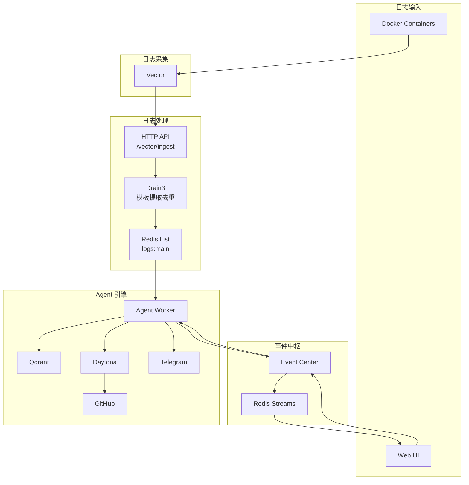
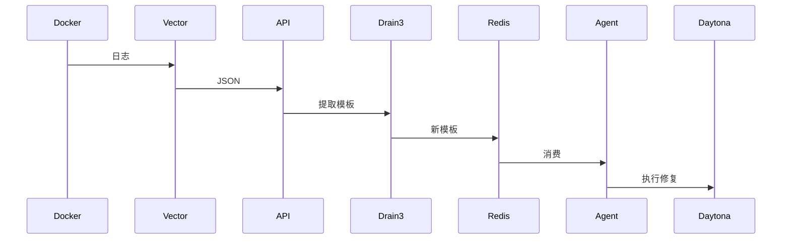
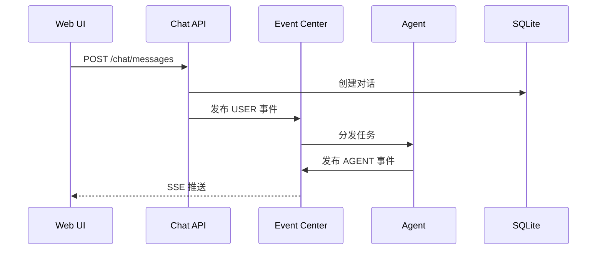

# 后端架构设计

## 系统架构



## 核心组件

### 1. 日志采集层（Vector）

- **Source**: 从 Docker 容器捕获日志
- **Transform**:
  - `merged_logs`: 多行聚合（Python Traceback、Java Stack Trace）
  - `error_only_filter`: 错误关键词过滤
- **Sink**: 发送到 HTTP API

### 2. 日志处理层

#### HTTP API（FastAPI）

- `/vector/ingest` - 接收 Vector 日志
- `/chat/*` - 聊天对话接口
- `/events/*` - SSE 事件流
- `/memory/*` - 记忆管理

#### Drain3 服务

- 在线学习日志模板
- 智能去重（相同模板只处理一次）
- 状态持久化到 `drain3.json`

### 3. 事件中枢（Event Center）

基于 Redis Streams 的事件驱动核心：

```python
# 事件类型
class EventType(Enum):
    USER = "USER"      # 用户消息
    AGENT = "AGENT"    # Agent 响应
    ERROR = "ERROR"     # 错误事件
    STATUS = "STATUS"   # 状态更新
```

- **Stream**: `auperator:events:all`
- **Consumer Groups**:
  - `web-ui` - Web UI SSE 推送
  - `agent-worker` - Agent 任务处理

### 4. Agent 引擎

参见 [DeepAgents 架构](deepagents.md)

## 数据流

### CLI 模式（自动修复）



### Web UI 模式（交互式）



## 技术选型

| 组件 | 技术 | 说明 |
|------|------|------|
| API 框架 | FastAPI | 高性能异步框架 |
| 消息队列 | Redis List + Streams | 日志队列 + 事件流 |
| 日志处理 | Drain3 | 模板提取去重 |
| Agent 编排 | LangGraph | 状态机编排 |
| 代码沙箱 | Daytona | 安全代码执行 |
| 持久化 | SQLite + Qdrant | 对话 + 向量记忆 |
| 状态持久化 | AsyncSqliteSaver | Agent 检查点 |

## 扩展性

### 添加新的日志源

编辑 `vector.yaml`：

```yaml
sources:
  - type: docker_logs
    # ...
  - type: file
    include_patterns:
      - /var/log/**/*.log
```

### 添加新的处理器

继承 `BaseLogHandler`：

```python
from auperator.collector.handlers.base import BaseLogHandler

class CustomHandler(BaseLogHandler):
    async def handle(self, entry: LogEntry):
        # 自定义处理逻辑
        pass
```

### 添加新的 API 端点

在 `routes/` 目录创建新路由文件：

```python
# routes/custom.py
from fastapi import APIRouter

router = APIRouter(prefix="/custom", tags=["custom"])

@router.get("/action")
async def custom_action():
    return {"result": "ok"}
```

然后在 `server.py` 中注册：

```python
app.include_router(custom_router)
```
