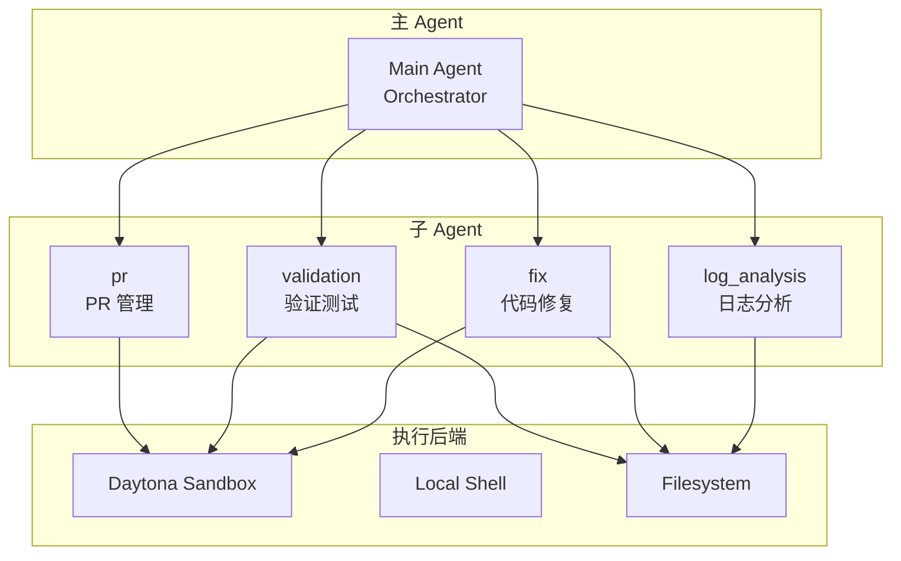

# DeepAgents 架构

DeepAgents 是 Auperator 的核心智能引擎，采用多 Agent 协作架构。

## 架构概览



## Agent 详解

### Main Agent（编排器）

- **职责**：协调所有子 Agent 工作
- **能力**：
  - 理解用户意图
  - 任务分解和分发
  - 结果汇总和呈现
  - 实时事件推送

### log_analysis（日志分析）

- **职责**：分析错误日志，定位问题
- **能力**：
  - 查询历史记忆（Qdrant）
  - 分类错误类型
  - 评估严重程度
  - 生成分析报告
- **工具**：`memory_tools`, `docker_tools`

### fix（代码修复）

- **职责**：实施代码修复
- **能力**：
  - 定位问题代码
  - 生成修复方案
  - 安全修改代码
  - 文档化变更
- **工具**：文件系统工具（read, edit, write, grep, glob）

### validation（验证测试）

- **职责**：验证修复有效性
- **能力**：
  - 运行测试套件
  - 检查代码质量
  - 回归测试
  - 修复效果评估
- **工具**：Shell 执行工具

### pr（PR 管理）

- **职责**：创建 Pull Request
- **能力**：
  - 生成 PR 描述
  - 创建分支
  - 提交代码
  - 发起 PR
- **工具**：`pr_tools`

## 执行后端

### Daytona Sandbox（默认）

- **用途**：安全的代码执行环境
- **特点**：
  - 隔离执行
  - 可重现
  - 支持多种语言
- **路由**：默认所有需要执行的代码

### Local Shell

- **路由**：以 `/local` 开头的路径
- **用途**：访问本地文件系统
- **注意**：生产环境慎用

### Filesystem

- **职责**：文件读写操作
- **接口**：read, write, edit, ls, glob, grep

## 工具系统

### 工具注册表

```python
from auperator.deepagents.tools.registry import ToolRegistry

# 获取工具组
docker_tools = ToolRegistry.get("docker")
memory_tools = ToolRegistry.get("memory")
pr_tools = ToolRegistry.get("pr")
```

### 可用工具

#### Docker Tools

| 工具 | 说明 |
|------|------|
| `get_container_info` | 获取容器信息 |
| `get_container_logs` | 获取容器日志 |
| `restart_container` | 重启容器 |
| `get_container_stats` | 获取容器统计 |
| `list_containers` | 列出容器 |
| `get_container_processes` | 获取容器进程 |

#### Memory Tools

| 工具 | 说明 |
|------|------|
| `save_memory` | 保存记忆到向量库 |
| `retrieve_memories` | 检索相似记忆 |

#### PR Tools

| 工具 | 说明 |
|------|------|
| `create_pull_request` | 创建 Pull Request |
| `get_pr_status` | 获取 PR 状态 |

#### State Tools

| 工具 | 说明 |
|------|------|
| `get_state` | 获取状态 |
| `set_state` | 设置状态 |
| `delete_state` | 删除状态 |

#### Vector Tools

| 工具 | 说明 |
|------|------|
| `get_docker_logs` | 获取 Docker 日志 |
| `query_vector_logs` | 查询 Vector 日志 |

## 中间件

中间件在 Agent 执行过程中提供额外能力，按执行顺序：

### 主 Agent 中间件

1. **TodoListMiddleware** - 任务清单管理
2. **EventAutoSendMiddleware** - 自动发送事件
3. **MemoryMiddleware** - 加载 AGENTS.md 记忆
4. **SkillsMiddleware** - 加载技能文件
5. **FilesystemMiddleware** - 文件操作
6. **SubAgentMiddleware** - 子 Agent 调度
7. **SummarizationMiddleware** - 输出摘要
8. **PatchToolCallsMiddleware** - 工具调用修补

### 子 Agent 中间件

1. **TodoListMiddleware**
2. **FilesystemMiddleware**
3. **SummarizationMiddleware**
4. **PatchToolCallsMiddleware**
5. **EventAutoSendMiddleware**
6. **SkillsMiddleware**（可选）

## 状态管理

### AuperatorState

```python
class AuperatorState(TypedDict):
    messages: Annotated[list[BaseMessage], add_messages]
    thread_id: str
    subagent_messages: list[SubAgentExecution]
    todo_list: list[dict]
    event_queue: list[dict]
```

### SubAgentExecution

记录子 Agent 执行历史：

```python
class SubAgentExecution(TypedDict):
    tool_call_id: str
    subagent_name: str
    messages: list[BaseMessage]
```

### 检查点持久化

使用 SQLite 保存 Agent 状态：

```python
from langgraph.checkpoint.sqlite import AsyncSqliteSaver

checkpointer = AsyncSqliteSaver.from_conn_string("auperator.db.sqlite3")
```

## 创建 Agent

```python
from auperator.deepagents import create_auperator

agent = create_auperator(
    model="gpt-4",
    checkpointer=checkpointer,
    debug=False,
)

# 异步调用
async for chunk in agent.astream({"messages": [HumanMessage("分析错误日志")]}, config):
    print(chunk)
```

## 提示词系统

### 系统提示词

位于 `src/auperator/deepagents/prompts/`：

| 文件 | 用途 |
|------|------|
| `system.py` | 主 Agent 系统提示词 |
| `log_analysis.py` | 日志分析 Agent 提示词 |
| `fix.py` | 代码修复 Agent 提示词 |
| `validation.py` | 验证 Agent 提示词 |
| `pr.py` | PR Agent 提示词 |
| `initialize.py` | 项目初始化提示词 |

### 技能文件

位于 `src/auperator/deepagents/skills/`：

- `vector/` - Daytona 沙箱管理技能

技能文件会在运行时动态加载。
