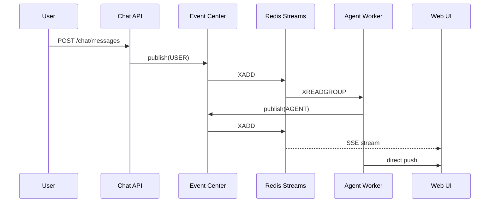

# 事件系统

## 概述

事件系统是 Auperator 的核心通信机制，基于 Redis Streams 实现事件驱动的架构。

## 核心概念

### Event Center

事件中心负责：
- 事件发布（publish）
- 事件消费（consume）
- 消费者组管理

```python
from auperator.events.event_center import EventCenter

center = EventCenter()
await center.publish(event_type="AGENT", content="分析完成")
```

### 事件类型

```python
class EventType(Enum):
    USER = "USER"      # 用户消息事件
    AGENT = "AGENT"    # Agent 响应事件
    ERROR = "ERROR"    # 错误事件
    STATUS = "STATUS"  # 状态更新事件
```

### 事件结构

```python
@dataclass
class Event:
    event_id: str          # 事件唯一ID
    thread_id: str         # 所属对话ID
    event_type: EventType  # 事件类型
    content: str           # 事件内容
    agent_name: str        # 来源 Agent 名称
    metadata: dict         # 额外元数据
    timestamp: datetime    # 时间戳
```

## Redis 数据结构

### Stream

- **Key**: `auperator:events:all`
- **类型**: Redis Stream

### 消费者组

| 消费者组 | 用途 |
|---------|------|
| `web-ui` | Web UI SSE 推送 |
| `agent-worker` | Agent 任务处理 |
| `telegram` | Telegram 通知 |

## 事件流程



## 使用示例

### 发布事件

```python
from auperator.events.event_center import EventCenter

center = EventCenter()

# 发布用户消息事件
await center.publish(
    event_type="USER",
    content="帮我分析这个错误",
    thread_id="conversation-uuid",
)

# 发布 Agent 事件
await center.publish(
    event_type="AGENT",
    content="正在分析日志...",
    agent_name="log_analysis",
    thread_id="conversation-uuid",
)
```

### 消费事件

```python
async for event in center.consume(group="my-consumer"):
    print(f"收到事件: {event.event_type} - {event.content}")
```

### Web UI SSE

```typescript
// 前端连接 SSE
const eventSource = new EventSource('/api/events/web-ui', {
  method: 'POST',
  body: JSON.stringify({ thread_id: 'conversation-uuid' }),
});

eventSource.addEventListener('agent', (e) => {
  const data = JSON.parse(e.data);
  console.log('Agent 响应:', data.content);
});
```

## 实时推送机制

### Agent → Web UI

Agent 处理过程中会实时推送中间状态：

```python
async def process_with_streaming():
    async for chunk in agent.astream(input):
        # 发布每个输出块
        await event_center.publish(
            event_type="AGENT",
            content=chunk.content,
            agent_name="fix",
        )
```

### 消费者组消息确认

```python
async for event in center.consume(group="web-ui"):
    # 处理事件
    await sse.send(event)

    # 确认消息
    await center.ack(event.event_id)
```

## 与 Web UI 的集成

### 端点

- `POST /events/web-ui` - Web UI SSE 流
- `POST /events/docker-logs` - Docker 日志流

### 前端实现

```typescript
// hooks/useSSE.ts
export function useSSE(threadId?: string) {
  const [events, setEvents] = useState<Event[]>([]);

  useEffect(() => {
    const es = new EventSource('/api/events/web-ui', {
      method: 'POST',
      body: JSON.stringify({ thread_id: threadId }),
    });

    es.addEventListener('agent', (e) => {
      setEvents(prev => [...prev, JSON.parse(e.data)]);
    });

    return () => es.close();
  }, [threadId]);

  return { events };
}
```

## Telegram 集成

Telegram 消费者组会监听 AGENT 事件并推送到 Telegram：

```python
# telegram_service.py
async def start_consumer(self):
    async for event in event_center.consume(group="telegram"):
        if event.event_type == "AGENT":
            await self.send_message(event.content)
```

## 监控和调试

### 查看 Stream 内容

```bash
redis-cli XRANGE auperator:events:all - + COUNT 10
```

### 查看消费者组

```bash
redis-cli XINFO GROUPS auperator:events:all
```

### 查看消费者状态

```bash
redis-cli XINFO CONSUMERS auperator:events:all web-ui
```

### 消费延迟监控

```python
async def monitor_events():
    async for event in event_center.consume(group="monitor"):
        latency = datetime.now() - event.timestamp
        print(f"延迟: {latency.total_seconds()}s")
```
