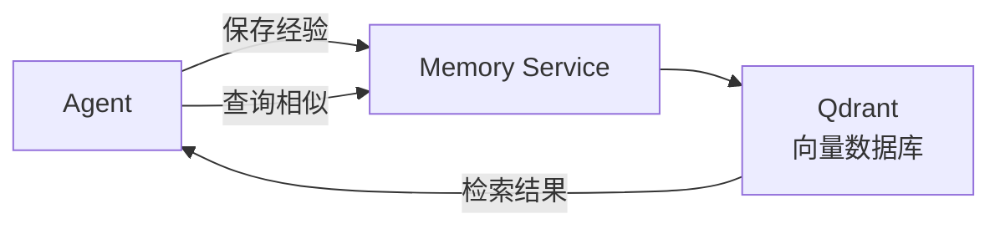

# 记忆服务

## 概述

记忆服务基于 Qdrant 向量数据库，提供语义搜索能力，让 Agent 能够记住历史问题和解决方案。

## 架构



## 数据模型

### 记忆条目

```python
@dataclass
class MemoryEntry:
    id: str                    # 唯一 ID
    section: str               # 分区（如 problems、solutions、context）
    content: str               # 内容文本
    embedding: list[float]     # 向量嵌入
    metadata: dict             # 额外元数据
    created_at: datetime       # 创建时间
```

### 分区

| 分区 | 说明 | 示例 |
|------|------|------|
| `problems` | 问题描述 | "数据库连接超时问题" |
| `solutions` | 解决方案 | "增加连接池大小" |
| `context` | 上下文信息 | "项目使用 Django 3.2" |

## 配置

```bash
# Qdrant 配置
QDRANT_URL=http://localhost:6333
QDRANT_API_KEY=              # 可选
QDRANT_COLLECTION=auperator_memories

# 嵌入配置
EMBEDDING_API_BASE_URL=https://api.openai.com/v1
EMBEDDING_API_KEY=your-api-key
EMBEDDING_MODEL=text-embedding-3-small
EMBEDDING_VECTOR_SIZE=1536
```

## 使用

### 保存记忆

```python
from auperator.services.memory_service import MemoryService

service = MemoryService()

# 保存问题-解决方案对
await service.save(
    section="problems",
    content="数据库连接超时，错误信息：Connection refused to 192.168.1.1:5432",
    metadata={
        "solution": "检查 PostgreSQL 服务状态，确保端口正确",
        "tags": ["database", "connection"],
    }
)
```

### 检索记忆

```python
# 按语义相似度搜索
results = await service.search(
    query="数据库连接问题",
    section="problems",
    limit=5,
)

for result in results:
    print(f"分数: {result.score}")
    print(f"内容: {result.content}")
    print(f"元数据: {result.metadata}")
```

### 多分区加权检索

```python
# 从多个分区检索并加权
results = await service.search_weighted(
    query="修复了什么错误",
    weights={
        "problems": 0.4,
        "solutions": 0.4,
        "context": 0.2,
    },
    limit=10,
)
```

## 与 Agent 集成

### 日志分析 Agent

```python
async def analyze_log(log_message: str):
    memory_service = MemoryService()

    # 1. 查询相似历史问题
    similar = await memory_service.search(
        query=log_message,
        section="problems",
        limit=3,
    )

    # 2. 构建提示词上下文
    context = ""
    if similar:
        context = "类似历史问题：\n"
        for item in similar:
            context += f"- {item.content}\n"
            if item.metadata.get("solution"):
                context += f"  解决方案: {item.metadata['solution']}\n"

    # 3. 调用 Agent
    prompt = f"""
    当前错误：{log_message}

    {context}

    请分析这个错误。
    """
```

### 保存学习成果

```python
async def after_fix(log_message: str, fix_result: str):
    memory_service = MemoryService()

    # 保存问题
    await memory_service.save(
        section="problems",
        content=log_message,
    )

    # 保存解决方案
    await memory_service.save(
        section="solutions",
        content=f"问题: {log_message}\n解决方案: {fix_result}",
        metadata={"related_problem": log_message},
    )
```

## Qdrant Collection

### 自动创建

首次使用时会自动创建 Collection：

```python
service = MemoryService()
# 自动创建 auperator_memories Collection
```

### Collection 配置

```json
{
  "name": "auperator_memories",
  "vectors": {
    "size": 1536,
    "distance": "Cosine"
  }
}
```

### 手动管理

```bash
# 查看 Collection
curl http://localhost:6333/collections/auperator_memories

# 删除 Collection
curl -X DELETE http://localhost:6333/collections/auperator_memories

# 查看所有点
curl http://localhost:6333/collections/auperator_memories/points scroll
```

## 调试

### 检查 Qdrant 连接

```python
from qdrant_client import QdrantClient

client = QdrantClient(url="http://localhost:6333")
print(client.get_collections())
```

### 查看记忆内容

```python
results = await memory_service.get_all(limit=100)
for r in results:
    print(f"[{r.section}] {r.content[:100]}")
```

### 清空记忆

```python
await memory_service.delete_all()  # 清空所有记忆
```
