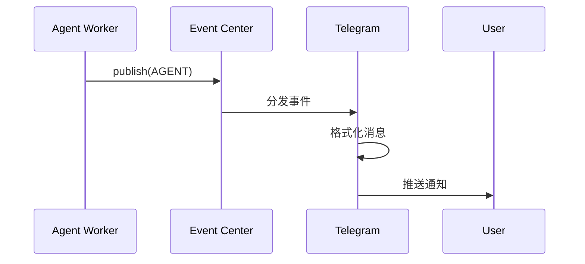

# Telegram 服务

## 概述

Telegram 服务将 Agent 处理结果实时推送到 Telegram 聊天，实现移动端通知。

## 功能

- **实时推送**：Agent 事件自动推送到 Telegram
- **WebHook 模式**：使用 WebHook 接收用户消息
- **简单配置**：仅需 Bot Token 即可启用

## 配置

```bash
# Telegram 配置
TELEGRAM_BOT_TOKEN=your-bot-token
TELEGRAM_WEBHOOK_URL=https://your-domain.com/telegram/webhook
TELEGRAM_WEBHOOK_SECRET=your-secret
```

## 获取 Bot Token

1. 在 Telegram 搜索 `@BotFather`
2. 发送 `/newbot`
3. 按照提示创建 Bot
4. 复制获得的 Token

## 设置 WebHook

### 自动设置

```python
from auperator.services.telegram_service import TelegramService

service = TelegramService()

# 设置 WebHook
await service.set_webhook("https://your-domain.com/telegram/webhook")
```

### 手动设置

使用 Telegram Bot API：

```bash
curl -X POST "https://api.telegram.org/bot<TOKEN>/setWebhook" \
  -d "url=https://your-domain.com/telegram/webhook"
```

## 使用

### 启动消费者

```python
service = TelegramService()

# 启动后台消费者
await service.start_consumer()
```

消费者会监听 Redis Streams 中的 `telegram` 消费者组，收到 AGENT 事件后自动推送。

### 发送消息

```python
# 手动发送消息
await service.send_message(
    text="Agent 已开始处理错误日志",
    chat_id="user-chat-id",
)

# 格式化消息
await service.send_message(
    text="""
🔔 *新事件*

Agent: log_analysis
状态: 分析完成

问题: 数据库连接超时
建议: 检查 PostgreSQL 服务
    """,
    parse_mode="Markdown",
)
```

### 获取 WebHook 信息

```python
info = await service.get_webhook_info()
print(f"WebHook URL: {info.url}")
print(f"待处理消息: {info.pending_update_count}")
```

## 消息格式

### 支持的格式

| 格式 | 解析模式 | 示例 |
|------|----------|------|
| 纯文本 | - | `Hello World` |
| Markdown | `Markdown` | `*粗体* _斜体_` |
| HTML | `HTML` | `<b>粗体</b>` |

### 推荐格式

```python
message = f"""
🤖 *Auperator 通知*

状态: {status}
Agent: {agent_name}

{message_content}

---
时间: {timestamp}
"""
```

## 与事件系统集成



## 消息过滤

可以配置只推送特定类型的事件：

```python
service = TelegramService(
    filter_types=["AGENT", "ERROR"],  # 只推送这些类型
    exclude_agents=["validation"],     # 排除特定 Agent
    min_importance=1,                   # 最小重要性级别
)
```

## 调试

### 测试 Bot

直接与 Bot 对话：

1. 在 Telegram 搜索你的 Bot
2. 发送 `/start`
3. 应该收到欢迎消息

### 查看 Bot 信息

```bash
curl "https://api.telegram.org/bot<TOKEN>/getMe"
```

### 获取更新

```bash
curl "https://api.telegram.org/bot<TOKEN>/getUpdates"
```

### 日志

Telegram 服务会记录：

```python
import logging

logging.getLogger("auperator.telegram").setLevel(logging.DEBUG)

# 输出示例：
# DEBUG: 收到 Telegram Update: update_id=123456789
# INFO: 发送消息到 chat_id=123456789
# ERROR: 发送失败: Chat not found
```

## 安全

### 验证 WebHook

```python
@app.post("/telegram/webhook")
async def webhook(update: Update):
    # 验证 secret token
    if request.headers.get("X-Telegram-Bot-Api-Secret-Token") != SECRET:
        return {"error": "Unauthorized"}

    # 处理更新
    await service.handle_update(update)
```

### 限制访问

```python
# 只允许特定用户
ALLOWED_USERS = ["user_id_1", "user_id_2"]

async def handle_update(update: Update):
    if str(update.message.chat.id) not in ALLOWED_USERS:
        await service.send_message(
            chat_id=update.message.chat.id,
            text="你没有权限使用此 Bot",
        )
        return
```

## 命令

Bot 支持以下命令：

| 命令 | 说明 |
|------|------|
| `/start` | 开始使用 |
| `/status` | 查看系统状态 |
| `/recent` | 最近事件 |
| `/stop` | 暂停通知 |
| `/help` | 帮助信息 |
