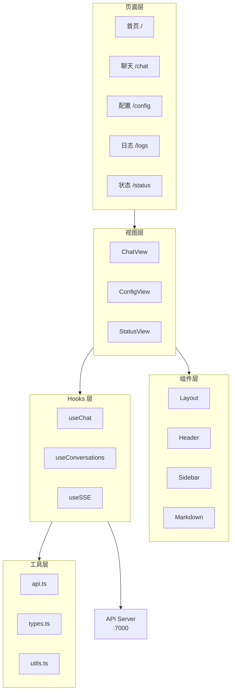
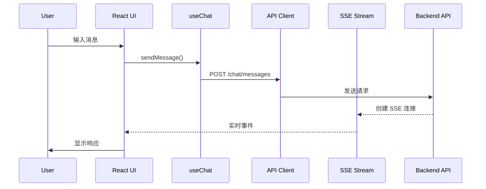

# 前端架构设计

## 技术栈

| 技术 | 版本 | 用途 |
|------|------|------|
| Next.js | 16.2.1 | React 框架（App Router） |
| TypeScript | 5.x | 类型安全 |
| Tailwind CSS | 4.x | 样式方案 |
| shadcn/ui | 4.1.1 | 组件库 |
| Radix UI | 最新 | 无头组件 |

## 项目架构



## 核心模块

### 1. 布局系统

```
MainLayout
├── Header         # 顶部导航
├── Sidebar        # 侧边栏（对话列表）
└── Content        # 主内容区
```

### 2. 视图组件

| 组件 | 路径 | 说明 |
|------|------|------|
| ChatView | `components/views/ChatView.tsx` | 聊天主界面 |
| ConfigView | `components/views/ConfigView.tsx` | 配置管理界面 |
| StatusView | `components/views/StatusView.tsx` | 系统状态监控 |

### 3. 自定义 Hooks

#### useChat

聊天状态管理：

```typescript
const {
  messages,        // 消息列表
  sendMessage,     // 发送消息
  isLoading,       // 加载状态
  error,           // 错误信息
} = useChat(conversationId);
```

#### useConversations

对话列表管理：

```typescript
const {
  conversations,   // 对话列表
  create,          // 创建对话
  rename,          // 重命名
  remove,          // 删除
  select,          // 选择当前对话
} = useConversations();
```

#### useSSE

SSE 实时通信：

```typescript
const { events, connect, disconnect } = useSSE({
  endpoint: '/api/events/web-ui',
  threadId: conversationId,
});
```

### 4. API 客户端

`lib/api.ts` 封装了所有 API 调用：

```typescript
// 对话管理
api.getConversations()
api.createConversation(title)
api.updateConversation(id, data)
api.deleteConversation(id)

// 消息
api.sendMessage(conversationId, content)
api.getMessages(conversationId)

// 事件流
api.createEventSource(threadId)

// 记忆
api.searchMemories(query)
api.saveMemory(section, content)
```

## 数据流



## 状态管理

采用 React Hooks 进行状态管理，无 Redux/Zustand 等外部状态库：

- **全局状态**：React Context（对话列表、用户偏好）
- **局部状态**：useState / useReducer
- **服务端状态**：SWR 或原生 fetch + re-render

## 样式方案

### Tailwind CSS 4

```tsx
// 使用 Tailwind 类名
<div className="flex items-center gap-4 p-4">
  <span className="text-sm text-gray-500">Hello</span>
</div>
```

### shadcn/ui 组件

```tsx
import { Button } from "@/components/ui/button"
import { Card } from "@/components/ui/card"

<Button variant="default">Click me</Button>
<Card>Content</Card>
```

## 路由结构

| 路径 | 页面 | 说明 |
|------|------|------|
| `/` | 首页 | 重定向到 /chat |
| `/chat` | 聊天页面 | 主聊天界面 |
| `/config` | 配置页面 | 系统配置 |
| `/logs` | 日志页面 | 日志查看 |
| `/status` | 状态页面 | 系统状态 |

## 扩展指南

### 添加新页面

1. 创建 `app/new-page/page.tsx`
2. 在 `AppLayoutClient.tsx` 添加导航项

### 添加新组件

1. 放入 `components/ui/` 或 `components/views/`
2. 使用 shadcn/ui 基础组件

### 添加新 API

1. 在 `lib/api.ts` 添加方法
2. 使用统一的错误处理
