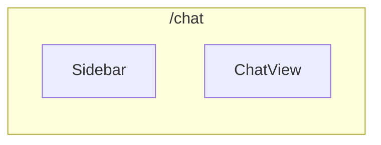

# 页面路由

## 路由概览

```
src/web/app/
├── layout.tsx              # 根布局
├── page.tsx                # 首页（重定向）
├── AppLayoutClient.tsx     # 布局客户端组件
├── globals.css             # 全局样式
│
├── chat/
│   └── page.tsx           # 聊天页面
│
├── config/
│   └── page.tsx           # 配置页面
│
├── logs/
│   └── page.tsx           # 日志页面
│
├── status/
│   └── page.tsx           # 状态页面
│
└── api/
    └── events/
        ├── docker-logs/
        │   └── route.ts   # Docker 日志 SSE
        └── web-ui/
            └── route.ts    # Web UI 事件 SSE
```

## 页面详解

### 首页 /

自动重定向到 `/chat`。

```typescript
// app/page.tsx
export default function Home() {
  redirect('/chat')
}
```

### 聊天页面 /chat

主聊天界面，提供与 Agent 的实时对话功能。



**功能**：
- 对话列表（侧边栏）
- 新建对话
- 发送消息
- 实时 SSE 响应
- Markdown 渲染

**布局结构**：

```
┌─────────────────────────────────────────┐
│  Header: Auperator                       │
├──────────┬──────────────────────────────┤
│          │                              │
│ Sidebar  │      ChatView                │
│          │                              │
│ • Conv 1 │  ┌────────────────────────┐  │
│ • Conv 2 │  │ Messages              │  │
│ • Conv 3 │  │                       │  │
│          │  │ User: Hello           │  │
│ [+ New]  │  │ Agent: Hi!            │  │
│          │  │                       │  │
│          │  └────────────────────────┘  │
│          │  ┌────────────────────────┐  │
│          │  │ Input                 │  │
│          │  └────────────────────────┘  │
└──────────┴──────────────────────────────┘
```

### 配置页面 /config

系统配置管理界面。

**可配置项**：

| 配置项 | 说明 |
|--------|------|
| API 地址 | 后端 API 地址 |
| Redis | Redis 连接信息 |
| OpenAI | API Key、模型选择 |
| Daytona | 沙箱配置 |
| 记忆系统 | Qdrant 配置 |

**布局**：

```
┌─────────────────────────────────────────┐
│  Header: Configuration                  │
├─────────────────────────────────────────┤
│                                         │
│  ┌─────────────────────────────────┐    │
│  │ API Configuration               │    │
│  │ ─────────────────────────────── │    │
│  │ API URL: [_______________]      │    │
│  │ Port:    [_______________]      │    │
│  └─────────────────────────────────┘    │
│                                         │
│  ┌─────────────────────────────────┐    │
│  │ Redis Configuration             │    │
│  │ ─────────────────────────────── │    │
│  │ Host:    [_______________]      │    │
│  │ Port:    [_______________]      │    │
│  └─────────────────────────────────┘    │
│                                         │
│                    [Save Configuration]  │
└─────────────────────────────────────────┘
```

### 日志页面 /logs

Docker 日志查看界面。

**功能**：
- 实时日志流
- 容器筛选
- 日志级别过滤
- 日志搜索

### 状态页面 /status

系统健康状态监控。

**监控指标**：

| 组件 | 状态 |
|------|------|
| Redis | ● Connected / ○ Disconnected |
| Qdrant | ● Connected / ○ Disconnected |
| Agent | ● Idle / ● Processing |
| API | ● Healthy / ○ Error |

**布局**：

```
┌─────────────────────────────────────────┐
│  Header: System Status                  │
├─────────────────────────────────────────┤
│                                         │
│  ┌─────────┐ ┌─────────┐ ┌─────────┐    │
│  │  Redis  │ │ Qdrant  │ │  API    │    │
│  │  ● OK   │ │  ● OK   │ │  ● OK   │    │
│  └─────────┘ └─────────┘ └─────────┘    │
│                                         │
│  ┌─────────────────────────────────┐    │
│  │ Recent Events                   │    │
│  │ ─────────────────────────────  │    │
│  │ 10:30:00 Agent started          │    │
│  │ 10:29:55 New conversation      │    │
│  │ 10:25:00 Error processed       │    │
│  └─────────────────────────────────┘    │
│                                         │
└─────────────────────────────────────────┘
```

## API 路由

### POST /api/events/web-ui

Web UI SSE 事件流端点。

**请求**：

```typescript
// Next.js API Route
const response = await fetch('/api/events/web-ui', {
  method: 'POST',
  headers: { 'Content-Type': 'application/json' },
  body: JSON.stringify({ thread_id: 'conversation-uuid' }),
})
```

**响应**：`text/event-stream`

```typescript
// 前端使用
const es = new EventSource('/api/events/web-ui')

es.addEventListener('agent', (e) => {
  const data = JSON.parse(e.data)
  console.log(data) // { event_type: 'AGENT', content: '...', agent_name: 'fix' }
})
```

### POST /api/events/docker-logs

Docker 日志 SSE 流端点。

**响应**：`text/event-stream`

```typescript
es.addEventListener('log', (e) => {
  const data = JSON.parse(e.data)
  console.log(data) // { container: 'backend-1', message: '...', timestamp: '...' }
})
```

## 布局组件

`AppLayoutClient.tsx` 负责将布局组件包裹所有页面：

```tsx
// app/AppLayoutClient.tsx
export function AppLayoutClient({ children }: { children: React.ReactNode }) {
  return (
    <MainLayout>
      {children}
    </MainLayout>
  )
}
```

## 导航

侧边栏自动生成导航链接：

```typescript
const navItems = [
  { href: '/chat', label: 'Chat', icon: MessageCircle },
  { href: '/logs', label: 'Logs', icon: FileText },
  { href: '/status', label: 'Status', icon: Activity },
  { href: '/config', label: 'Config', icon: Settings },
]
```
